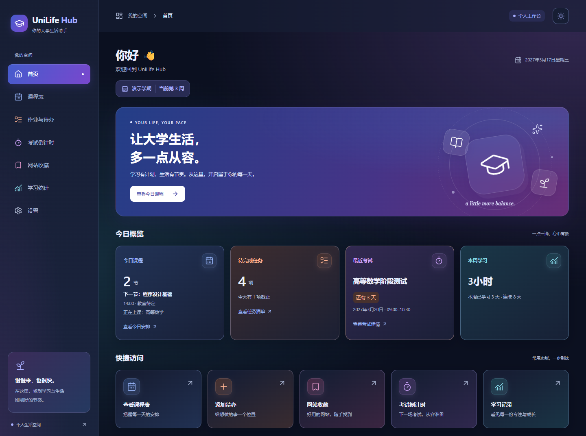
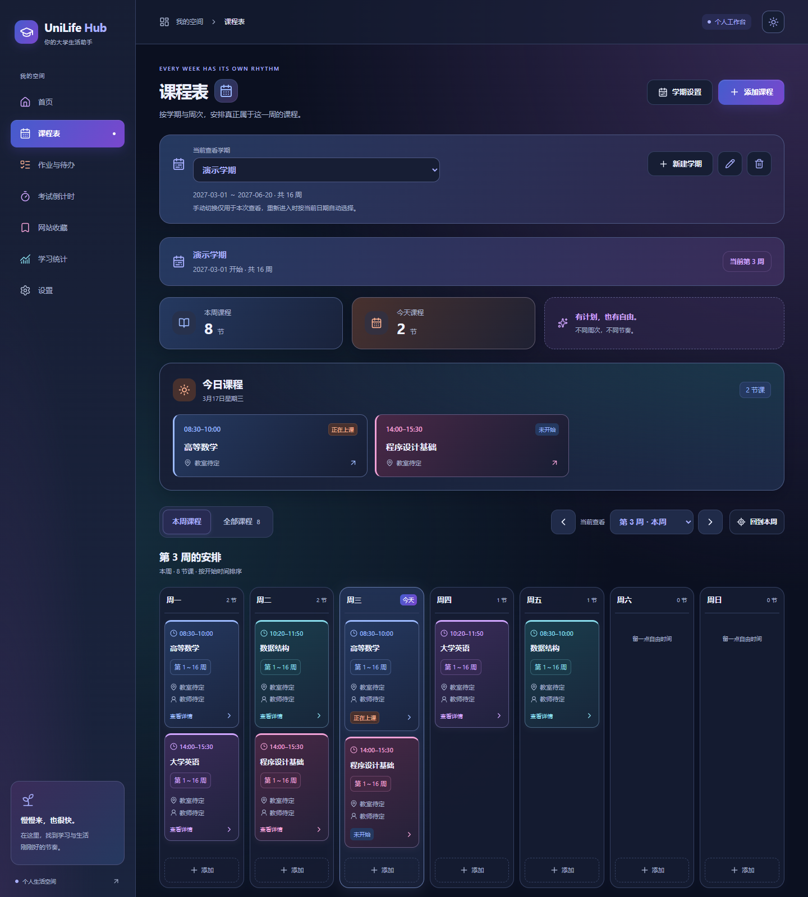
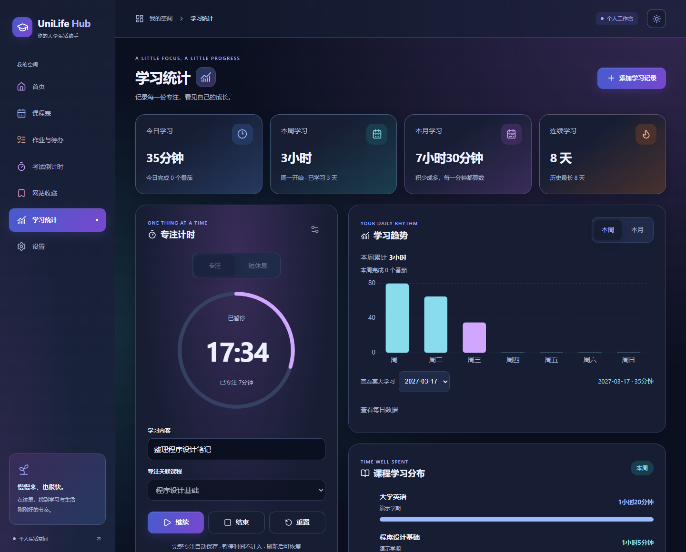
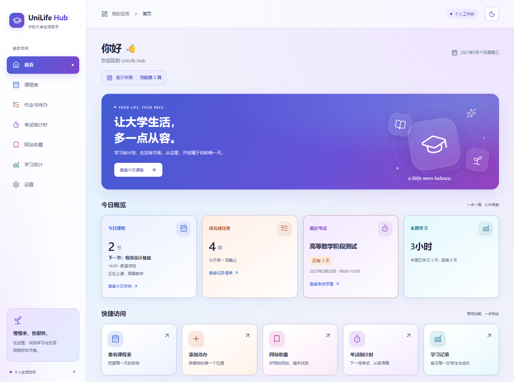
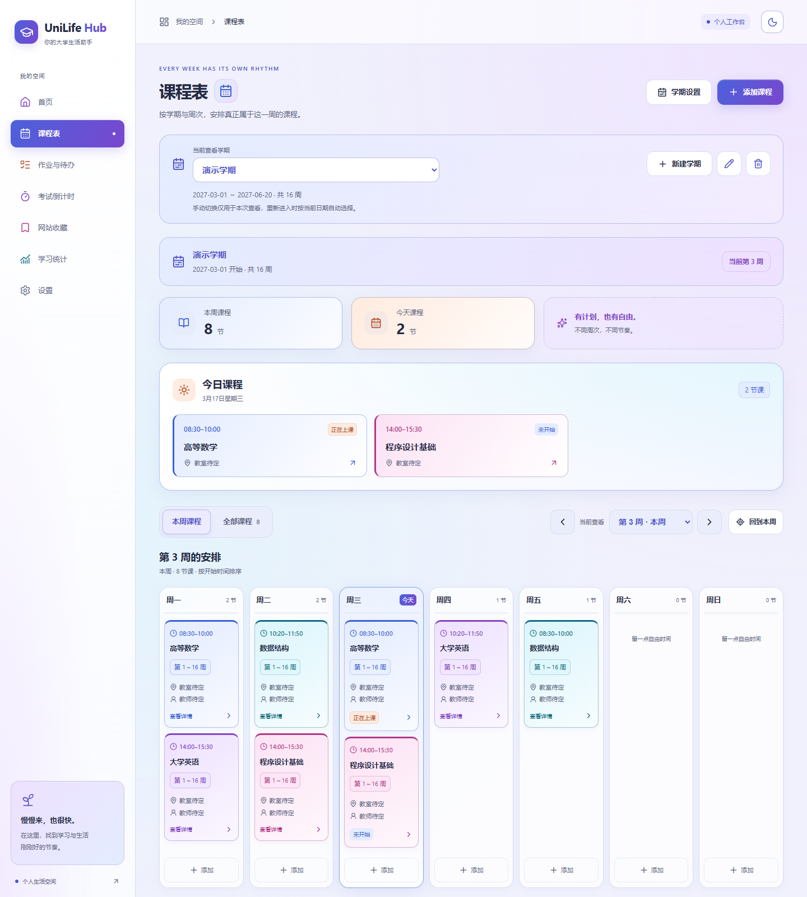
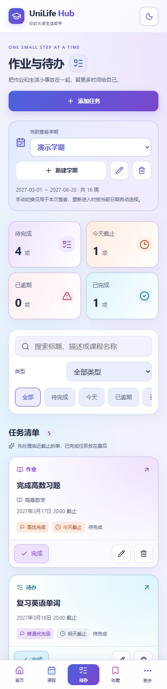

# UniLife Hub

一个本地优先的大学生活与学习管理 PWA，将课程、任务、考试、收藏和专注记录放在同一个工作台。支持浅色与深色主题、桌面与手机布局，以及 JSON 备份迁移。

A local-first student productivity PWA for planning semesters, tracking deadlines and recording focused study. No account or cloud sync.

`React 19` · `TypeScript 5.9` · `Vite 7` · `PWA` · `Local-first`

版本 **0.7.0** · [Quick Start](#quick-start) · [功能说明](#核心功能速览) · [隐私设计](#浏览器本地数据与隐私) · [更多截图](#更多截图)



所有截图均使用虚构演示数据，不来自用户浏览器。Screenshots contain fictional demo data, not real user records. 当前应用界面为中文。

## 核心亮点 / Highlights

- **课程与截止 / Plan your semester** — Weekly timetables, assignments, priorities and exam countdowns across semesters.
- **学习与专注 / Focus and review** — A resumable Pomodoro timer, study records and time-based statistics.
- **常用资源 / Keep resources close** — Searchable website bookmarks with categories and pinned entries.
- **本地与离线 / Keep data local** — Browser-local data, offline use after initial setup, and JSON backup for manual migration.

## Quick Start

需要 Node.js 20.19+（20 系列）或 22.12+。Requires Node.js 20.19+ (20.x) or 22.12+.

```sh
git clone https://github.com/FREExuanwei/unilife-hub.git
cd unilife-hub
npm install
npm run dev
```

生产构建：`npm run build`；本地预览：`npm run preview`。Windows PowerShell 的 `npm.cmd` 用法与完整命令见[开始使用](#开始使用)。

开发服务器不注册 Service Worker；PWA 离线使用的准备条件见 [PWA 与离线使用](#pwa-与离线使用)。

## 技术栈

| 用途 | 技术 |
| --- | --- |
| 界面与类型 | React 19、TypeScript 5.9 |
| 开发与构建 | Vite 7 |
| 路由与图标 | React Router 7、Lucide React |
| 本地数据与离线 | localStorage、原生 Service Worker、Web App Manifest |

## 核心功能速览

| 功能 | 能力 |
| --- | --- |
| 课程表 | 多学期、按周安排、单/双周与自定义周次、时间冲突提示、今日课程 |
| 作业与考试 | 作业和普通待办、优先级与截止筛选、课程关联、考试倒计时 |
| 学习与专注 | 手动学习记录、趋势与课程统计、可恢复的番茄钟、完成提醒 |
| 网站收藏 | 分类、搜索、置顶、自定义图标 |
| 数据管理 | JSON 备份导出、校验与预览后恢复、跨设备或访问来源迁移 |
| PWA 与界面 | 首次在线完成资源准备后可离线使用，支持安装、浅深主题与响应式布局 |

## 浏览器本地数据与隐私

课程、任务、考试、收藏、学习记录与偏好保存在当前设备、当前访问来源的浏览器 localStorage 中。应用没有登录、远程数据库或云同步；不同设备、浏览器，以及不同协议、域名或端口的数据各自独立。

可在“设置 → 数据管理”导出 JSON 备份，再在目标设备或访问来源导入恢复。建议定期备份并自行保管；清除站点数据或使用隐私模式会影响本地数据保存。

收藏图标可能向收藏网站或自定义图片地址发起请求；外部收藏网站与图标不在离线缓存范围内。

## 更多截图

展开查看课程安排、深色专注界面与手机布局。以下课程、任务、考试与学习记录同样均为虚构演示数据。

<details>
<summary>桌面课程表 · 深色主题</summary>



</details>

<details>
<summary>学习统计与番茄钟 · 深色主题</summary>



</details>

<details>
<summary>桌面首页 · 浅色主题</summary>



</details>

<details>
<summary>桌面课程表 · 浅色主题</summary>



</details>

<details>
<summary>手机任务页 · 浅色主题</summary>



</details>

## 开始使用

需要 Node.js 20.19+（20 系列）或 22.12+，建议使用当前 LTS 版本。

```sh
cd unilife-hub
npm install
npm run dev
```

如果已经在项目目录中，无需执行 `cd`。开发服务器默认地址为 <http://localhost:5173>，端口被占用时以终端实际输出为准。

Windows PowerShell 如果阻止执行 `npm.ps1`，可以使用 `npm.cmd install` 和 `npm.cmd run dev`，无需修改系统执行策略。

```sh
npm run typecheck
npm run build
npm run preview
```

`build` 先执行严格 TypeScript 检查，再生成 `dist/`。提交的 `package-lock.json` 固定本次安装版本，可使用 `npm ci` 复现依赖。

## 目录

```text
src/
  components/  导航、页头、主题按钮、卡片、共享弹窗与错误边界
  features/
    bookmarks/ 收藏类型、存储、共享状态、表单、弹窗、卡片与筛选
    courses/   课程类型、校验、存储、共享状态、周视图、单日列表与表单
    semester/  学期类型、周次计算、迁移规则、学期表单与周次选择组件
    tasks/     任务类型、结构校验、截止计算、筛选排序、表单与详情组件
    exams/     考试类型、结构校验、本地倒计时、筛选排序、表单与详情组件
    study/     学习记录类型、校验、日期聚合、筛选、趋势图与记录管理组件
    pomodoro/  持久计时状态机、活跃时间段、设置、控制与恢复
    backup/    备份类型、校验迁移、恢复事务与数据管理界面
    reminders/ 提醒偏好、能力检测、声音振动、通知与完成反馈
    pwa/       安装状态、离线状态、更新提示与 Service Worker 注册
  layouts/     全局布局、路由标题和页面焦点管理
  pages/       七个页面与 404 页面
  hooks/       主题与当前日期
  utils/       类型、主题存储及统一导航配置
  styles/      设计变量、全局样式、布局、各业务页面与主题精修
  App.tsx      路由表与页面懒加载
  main.tsx     恢复日志检查、PWA 初始化与 React 入口
public/        Manifest、品牌图标、首次绘制主题脚本
scripts/       无额外依赖的 PWA 构建与图标生成
tests/         Node.js 原生自动测试
docs/          设计、实现与维护说明
netlify.toml   部署构建、SPA 路由、缓存、安全响应头与 noindex
```

## 路由与扩展

| 地址 | 页面 |
| --- | --- |
| `/` | 首页 |
| `/schedule` | 课程表 |
| `/tasks` | 作业与待办 |
| `/exams` | 考试倒计时 |
| `/bookmarks` | 网站收藏 |
| `/statistics` | 学习统计 |
| `/settings` | 设置 |

使用 React Router 的 BrowserRouter。Vite 开发和预览服务器支持子页面直接访问与刷新；正式 Netlify 站点使用 `netlify.toml` 的 SPA fallback、安全响应头和 noindex 配置。首页直接加载，其余六个功能页面按需加载，导航、全局计时和完成提醒保持挂载。

新增业务页面时替换对应的页面文件即可。侧栏、页头名称、手机导航共享 `utils/navigation.ts`。手机的“更多”使用原生 dialog，支持 Escape、点击遮罩关闭和键盘焦点约束。导航支持选中状态、浏览器历史、路由标题和内容焦点转移。

## 主题与布局

- 主题保存在 localStorage 的 `unilife-theme` 中，未保存选择时跟随系统，并监听系统主题变化。
- 同源外部 `theme-bootstrap.js` 在首次绘制前应用主题，兼容生产 CSP；CSS 变量集中定义两套配色。主题存储失败会明确提示，页面仍可使用。
- 桌面固定侧栏，平板使用更紧凑的侧栏与双列卡片，宽度低于 768px 时切换底部五项导航。
- 底部导航考虑手机安全区与页面内容留白；支持键盘可见焦点与减少动态效果设置。
- 配色使用蓝紫品牌渐变，课程蓝色、待办珊瑚橙、考试紫色、收藏粉紫色、统计青色。浅色使用冷白和淡蓝紫，深色使用深蓝黑。
- 首页今日课程、待完成任务、最近考试和本周学习读取真实数据。收藏区域展示最多 4 个网站，置顶优先，其余按添加时间排序。日期、课程、任务截止与考试倒计时来自设备本地时间，每分钟及回到页面时更新；学习数据变更立即重新计算统计。
- 卡片有轻微上浮、阴影和边框反馈，页面有短暂淡入；系统设置减少动态效果时关闭动画。

## 网站收藏

- 添加、编辑网站的名称、网址、分类、备注、置顶状态和图标；删除前确认。
- 默认分类：AI、学习、编程、学校、娱乐、工具、其他。在表单分类下拉框选择“新建分类”即可添加自定义分类，保存网站时一并保存分类。
- 搜索实时匹配名称、网址、分类和备注，可与分类筛选组合。排序支持按添加时间或名称，始终置顶优先。
- 未填写协议的网址自动补全 HTTPS；仅允许 HTTP(S)，保留路径、查询参数和锚点。主要卡片区域在新标签页打开，管理按钮独立操作。
- 图标默认直接加载目标网站自身的 `/favicon.ico`，失败时显示 Lucide 默认图标。可选择默认图标或自定义 HTTP(S) 图片链接。无需第三方图标服务。
- 收藏和分类保存在当前来源（协议、域名及端口）对应的 localStorage 中，键为 `unilife-bookmarks:v1`。首页、收藏页及同一来源的其他标签页即时同步。
- 首次无存储记录时提供 ChatGPT、GitHub、YouTube 三个示例，并立即保存。删除后保存空数组，刷新或重新打开浏览器不会再次生成示例。
- 存储写入失败时保留表单与已有数据，不显示虚假的保存成功；遇到损坏或不支持的存储格式时显示错误并阻止覆盖。
- 手机卡片单列，分类区域可横向滚动，表单使用可滚动的底部弹窗，管理按钮触摸高度至少 44px。

## 课程表

- 默认空课程，不自动生成演示数据。添加课程时填写名称、星期、真实开始/结束时间，可选教师、教室、备注和七种预设颜色。
- 首次进入先设置学期名称、开始日期和总周数；不假设 18/20 周。总周数提供 16/18/20/22 快捷选择，支持自定义 1～30 的整数，设置页和课程表均可修改。
- 周一至周日为一周，开始日期所在周为第 1 周；开始日期之前显示尚未开始，最后一周结束后显示已结束。使用本地日历日期计算，避免 UTC 日期解析与夏令时误差。
- 每门课保存 `weeks: number[]` 和 `weekMode`。每周、单周、双周支持开始/结束周；自定义用按钮选择不规则周次。新课程默认覆盖整个学期。详情与卡片显示可读的周次标签。
- 默认查看真实本周，可用选择器或前后按钮查看指定周；全部课程用于管理本周不上课或待安排的课程。大屏（1280px 起）显示七列；较小电脑、平板和手机使用星期选择及单日列表。
- 结束时间必须晚于开始时间，不支持跨午夜的一门课程。只在相同学期内，星期相同、时间重叠且周次有交集才提示冲突，并列出共同周次；确认后仍可保存。时间相邻、周次无交集及课程自身不算冲突。
- 点击课程查看完整详情，再进行编辑或确认删除。修改保留课程 ID 和创建时间。表单支持关闭、Esc、键盘焦点约束和手机滚动。
- 今日区域同时按真实周次与星期过滤，并按开始时间排序，状态显示未开始、正在上课或已结束。浏览其他周次不会改变今日课程和首页数据。
- 首页显示今天课程数、下一节课名称、开始时间和教室；正在上课时额外显示当前课程，全部结束后显示结束提示。Hero 的“查看今日课程”直接进入课程表并高亮今天。
- 首页显示学期名称与当前周；学期未开始、已结束或未设置时，不显示虚假的当日课程。
- 缩短学期会列出受影响课程，用户可取消或确认移除越界周次。课程本身始终保留；若不再有上课周次，标记为待安排，在全部课程中可重新编辑。延长学期不会擅自扩展原有课程的周次。
- 继续使用原有 localStorage 键 `unilife-courses:v1`，内容升级为 `{ version: 5, semesters: Semester[], courses: Course[], tasks: Task[], exams: Exam[], studyRecords: StudyRecord[], pomodoro: PomodoroData }`。各领域具有独立类型、校验与业务模块；共用一次原子快照写入，避免解除关联或完成专注时部分保存。所有共享写入使用同一个 Web Lock 串行提交，锁内验证最新快照；收藏存储仍独立。
- 兼容旧 `version: 4`，保留考试及全部原字段，新增空学习记录和 25/5 分钟计时设置；`version: 3` 补充空考试数组。旧 `version: 2` 单学期快照自动绑定原课程到稳定学期 ID，保留所有字段与周次；成功写入 v5 后不重复迁移。兼容旧 `version: 1` 数据：没有学期的课程先完整保留，等待首次设置；没有周次的课程随后按整个学期每周上课迁移。不会清空 localStorage，存储失败保留原快照。
- 保存失败时保留输入与旧数据，可重试。损坏、无效或未知版本的数据会显示读取错误并阻止覆盖。删除全部课程后，刷新和重新打开浏览器仍保持为空。
- 浅色使用蓝紫、粉紫和青色背景光晕，深色保留深蓝黑基底；课程颜色在两套主题下分别使用柔和背景与清晰文字。

## 多学期

- 课程表、任务页、考试页与设置页均提供简单学期选择、新建、编辑和确认删除；新学期不复制旧课程。各学期日期、总周数、课程、周次和考试完全独立。
- 每次重新进入页面按设备当前日期选择对应学期；手动查看历史学期只存在于当前页面。首页始终使用日期对应学期。
- 日期范围从开学当天到第 N 周周日。日期不在任何已设置学期中时，展示最近学期并提示，仍不产生假期的今日课程；距离相同时优先未来学期。重叠日期范围会提示并阻止保存。
- 删除学期明确显示课程、任务、考试、学习记录和活动计时的影响，需勾选确认后再次点击删除；至少保留一个学期。相关课程删除，任务默认转为全局待办并解除学期和课程关联，保留标题、截止、优先级与完成状态。有考试时必须选择另一个学期迁移，考试不随学期删除。学习记录始终保留，解除学期/课程关联并保留课程名称快照，活动计时也保留。

## 作业与待办

- 支持课程作业和普通待办，标题必填；描述、关联课程、截止日期和时间选填。作业必须选择学期，课程列表只显示该学期课程；没有课程也可创建不关联课程的作业。普通待办可以属于某一学期或全局。
- 当前学期任务和全局待办同时显示。类型、状态（全部、待完成、今天、已逾期、已完成）可组合筛选，实时搜索标题、描述和课程名称。
- 优先级支持低、普通、高、紧急。默认未完成在前，截止时间早的在前，相同截止按优先级；无截止在有截止之后，已完成在最后。
- 日期和时间均按设备本地时间计算。仅日期以当天结束为界，截止时间之后才逾期；无截止日期或已完成任务不逾期。显示今天、明天、3 天内及已逾期天数。
- 点击卡片查看完整详情，完成与恢复、编辑和确认删除使用独立按钮。完成记录 `completedAt`，恢复清空；编辑保留任务 ID、创建时间和完成状态。
- 删除关联课程时保留作业并清空 `courseId`，显示原课程已删除；课程详情中的相关作业入口跳转并筛选该课程。
- 首页显示真实待完成数量（日期对应学期加全局），最多 3 条近期未完成任务；“添加待办”会打开任务页的添加弹窗，消费一次性入口后刷新不会反复弹出。
- 无样例任务。刷新与重新打开浏览器保留数据，存储结构异常阻止覆盖，保存失败保留输入和旧数据。跨标签页同步使用整体快照，存储写入成功后才更新页面。
- 移动端单列、横向滚动状态筛选、触摸操作至少 44px、可滚动表单和原生弹窗焦点约束；主题继续使用原有色彩 token。

## 考试倒计时

- 添加、编辑、详情和确认删除；名称及考试日期必填，所属学期明确展示，关联课程只取该学期课程且可留空。六种考试类型用于标签和筛选。地点、座位、备注可选，全部以纯文本显示。
- 开始、结束时间分别可选，同时填写时结束必须晚于开始。特殊考试日期超出学期范围时提示，勾选确认后可以保存；修改日期或所属学期需重新确认。
- 未来按本地日历显示还有 N 天或明天考试。今天有开始时间时显示小时/分钟；到开始且尚未到明确结束时间显示进行中，到结束时进入历史。日期已过去也会结束。未填写结束时间不推测时长，当天持续显示今天考试，次日标记结束。
- 默认显示未结束考试，支持全部、即将考试、今天、7 天内（含今天至第 7 天）、已结束与类型筛选；搜索名称、课程名、地点和备注。未结束按日期时间升序，历史按日期时间倒序，记录一直保留。
- 学期统计和下一场考试随临时查看学期变化。首页始终使用真实日期对应学期的最近未结束考试，3 天内强调；日期不在任何学期范围时首页显示暂无考试。首页入口可打开考试详情，课程详情也显示关联的最近考试。
- 删除课程保留考试、清空课程关联并说明原课程已删除。删除含考试的学期必须选择有效目标学期，考试迁移并保留全部安排与创建时间，更新时间随迁移更新。日期超出新学期范围时也保留，可随后编辑。
- 考试独立使用 `examStorage` 结构校验，共享原子快照保护跨模块操作。损坏记录不会静默删除或覆盖；显示读取错误并阻止保存。存储配额失败保留表单和旧快照；刷新、浏览器重开与跨标签同步沿用现有机制。
- 手机单列、44px 管理按钮、可滚动筛选、表单和详情；复用浅深主题，紧急状态仅使用小面积红色强调。没有自动生成复习任务或系统通知。

## 学习记录与统计

- 手动记录支持直接填写整数分钟（1～1440）或本地日期的开始/结束时间自动计算；允许不关联课程和假期记录。时间段方式的跨午夜学习需拆成两条记录。
- 详情、编辑和确认删除即时更新全部统计。支持学习内容、课程名称和备注实时搜索，全部/本周/本月及课程组合筛选，历史按日期倒序、每页 12 条。
- 今日、本周（周一至周日）、自然月、当前连续天数及历史最长连续天数均来自真实记录；今天尚未学习时从昨天延续连续天数。临时查看历史学期不影响当前统计。
- SVG 本周/本月趋势图保留零数据日期，选择日期或展开每日数据可查看具体时长；课程条形统计按课程 ID 区分同名课程，未关联记录计入其他学习。首页本周学习和学习快捷入口同步联动。
- 课程名称快照保留创建时名称；课程或学期删除后学习历史仍在。主动编辑解除课程关联则清除旧快照。
- 独立 studyStorage / pomodoroStorage 解析数据，使用 v5 原子快照持久化。无示例学习数据；无效或未知版本数据保留原始存储、显示错误并阻止覆盖。配额失败保留输入和旧数据，可重试。

## 番茄钟

- 默认专注 25 分钟、短休息 5 分钟；专注支持 1～180 分钟、休息 1～60 分钟。开始前设置学习内容和可选课程，运行中冻结本次设置。
- 以目标结束时间与当前时间计算剩余时间，暂停保存剩余时间和实际活跃时间段；继续建立新目标。刷新、页面切换、后台返回、浏览器关闭重开均可恢复，过期专注只生成一次记录。
- 完整专注自动记录并提示进入休息，休息需主动开始且不计入学习；提前结束或重置需确认，可保存已完成的整分钟或放弃，不足一分钟不保存。
- 跨午夜专注按本地日期分配实际活跃分钟，暂停间隔不计入。系统时间回拨不会增加已保存的剩余时长；长时间暂停不影响历史恢复。
- 多标签页使用 Web Locks 序列化所有共享数据写入，周期 ID 防止重复记录。计时需浏览器支持 Web Locks（当前 Chrome/Edge 支持）；不支持时显示限制，手动学习记录仍可用。
- 完成后所有页面均显示持久提示卡片；可选短提示音、设备振动和系统通知，仍不自动连续循环。PC 两列布局、手机单列，弹窗可滚动，图表与圆形计时器适配窄屏。

## 专注提醒

- 设置 → 专注提醒可分别开关声音、振动、系统通知，并试听提示音。声音和振动默认开启，系统通知默认关闭。
- 声音由本地 Web Audio 生成；开始、继续或试听时通过用户交互初始化。专注完成为三声，休息完成为两声；没有远程音频依赖。
- 只有主动开启系统通知才请求权限；拒绝或忽略后不重复弹出权限请求。不支持、权限不足或播放失败时保留页面完成提示。
- 先成功保存计时结果与学习记录，再发送反馈。跨标签页通过共享锁和周期记录避免重复学习记录、声音、振动及通知；未初始化音频的标签页完成计时后，已初始化的标签页仍可播放一次声音。
- 提前结束或重置不产生完成提醒。刚好在到期时暂停或结束仍视为自然完成。
- 实际声音、振动和通知受浏览器权限、用户交互、设备能力及系统设置影响；关闭或被系统挂起的浏览器无法保证准点通知。没有后台推送服务。

## 数据管理与恢复

- 设置 → 数据管理提供导出、导入和清空。数据默认保存在当前设备浏览器中，建议定期导出备份。
- 导出文件名包含日期与时间；JSON 包含 `appName`、`backupVersion`、`schemaVersion`、`exportedAt` 和明确的数据结构。包含学期、课程与周次、收藏分类、任务、考试、学习记录、番茄钟设置、主题和提醒偏好。统计从学习记录重新计算。
- 不导出运行中的计时状态、临时页面状态、缓存、通知权限或提醒去重记录。导入保留计时设置并停止当前计时；预览中会说明这一点。
- 选择 JSON 文件后先校验，再展示备份时间和六类数据数量，确认后覆盖恢复；不进行容易产生重复记录的自动合并。旧数据结构自动迁移，未来版本、危险网址、无效或超大文件不会覆盖当前数据。
- 恢复使用共享 Web Lock 和持久恢复日志；写入失败回滚，关闭浏览器导致中断时下次启动先恢复，再挂载页面。无法恢复时显示友好说明并保护原始数据。不支持 Web Locks 的浏览器仍能导出，导入及清空会解释限制。
- 清空需两次确认，第二次必须输入“清空”。只重置 UniLife Hub 自己的用户数据和设置，保留其他应用的数据；收藏清空后不会重新生成示例。
- 某个业务模块损坏时，其余有效数据仍可查看；为防止共享快照覆盖原始记录，共享业务写入暂停，直到恢复有效备份。独立收藏不受课程快照损坏影响。
- 多标签页同步恢复结果；已打开的课程、学期、任务、考试、学习记录编辑表单若原记录被其他页面更新，会提示重新检查，避免旧表单覆盖新数据。

## PWA 与离线使用

- 生产构建包含 Manifest、192/512px 图标、maskable 图标和 Apple 图标，支持符合条件的浏览器安装；iPhone/iPad 可按设置页说明使用“分享 → 添加到主屏幕”。
- 首次在线打开并完成离线资源准备后，可离线访问七个页面、直接刷新子页面，查看和修改本地数据。只缓存自身 App Shell 和静态资源，外部收藏网站及 favicon 不会离线缓存。
- 检测到新版本会提示“刷新更新”，保存表单后再主动刷新；更新保留 localStorage，其他已打开标签页不会被强制刷新。保留上一版本资源，供旧标签页加载页面。
- `npm run dev` 不注册 Service Worker；本地验证请使用 `npm run build` 和 `npm run preview`。开发与生产预览建议使用不同端口，避免已有生产缓存影响热更新。
- 安装与 Service Worker 需要 HTTPS 或浏览器支持的 localhost 安全来源。设备数据独立保存，跨设备迁移使用备份；没有登录、数据库或云同步。

## 验证

```sh
npm test
npm run build
```

轻量测试使用 Node.js 原生测试工具和 TypeScript 读取能力，建议 Node.js 24 执行 `npm test`，没有额外测试依赖。应用开发和构建仍支持上文的 Node.js 版本。

本地验证记录、部署证据、缓存和浏览器测试产物保留在本机，由 `.gitignore` 排除。开发服务器忽略 `.verification/` 和 `.npm-cache/`，避免验证浏览器缓存的文件锁影响热更新。项目未配置 ESLint，没有额外检查依赖。

localStorage 按协议、域名和端口隔离。继续使用原来的访问地址即可读取原有数据；不同端口不会共享数据。浏览器隐私模式、主动清除站点数据或更换设备不会保留这一来源的本地数据。

不同访问来源各自拥有独立存储。迁移已有数据时，先在原来源的“设置 → 数据管理”导出备份，再在目标来源导入。导出的个人备份应由用户自行保管，不应提交到代码仓库。

## 依赖

运行时仅 React、React DOM、React Router、Lucide React。开发依赖仅 Vite、React 插件、TypeScript 和类型定义；没有 UI 框架、状态库、图表库或远程字体依赖。

## 许可状态 / License status

本仓库目前没有 LICENSE 文件，尚未声明开源许可证。This repository does not currently specify an open-source license.
